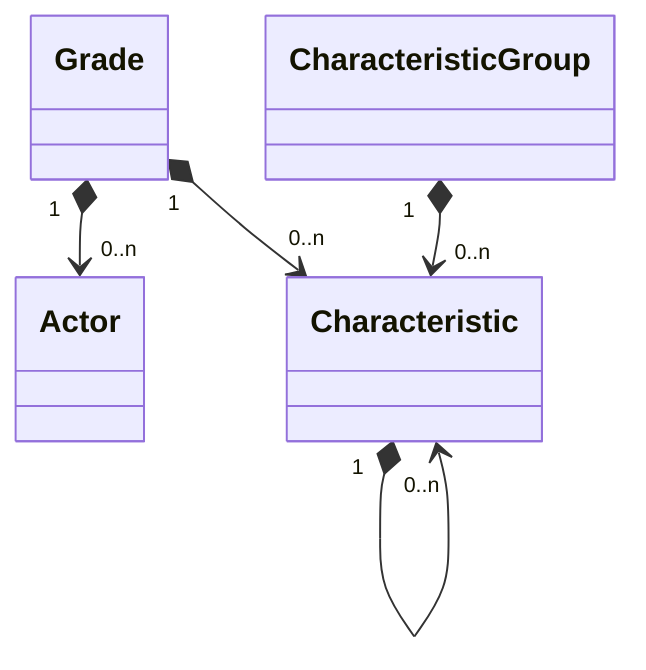
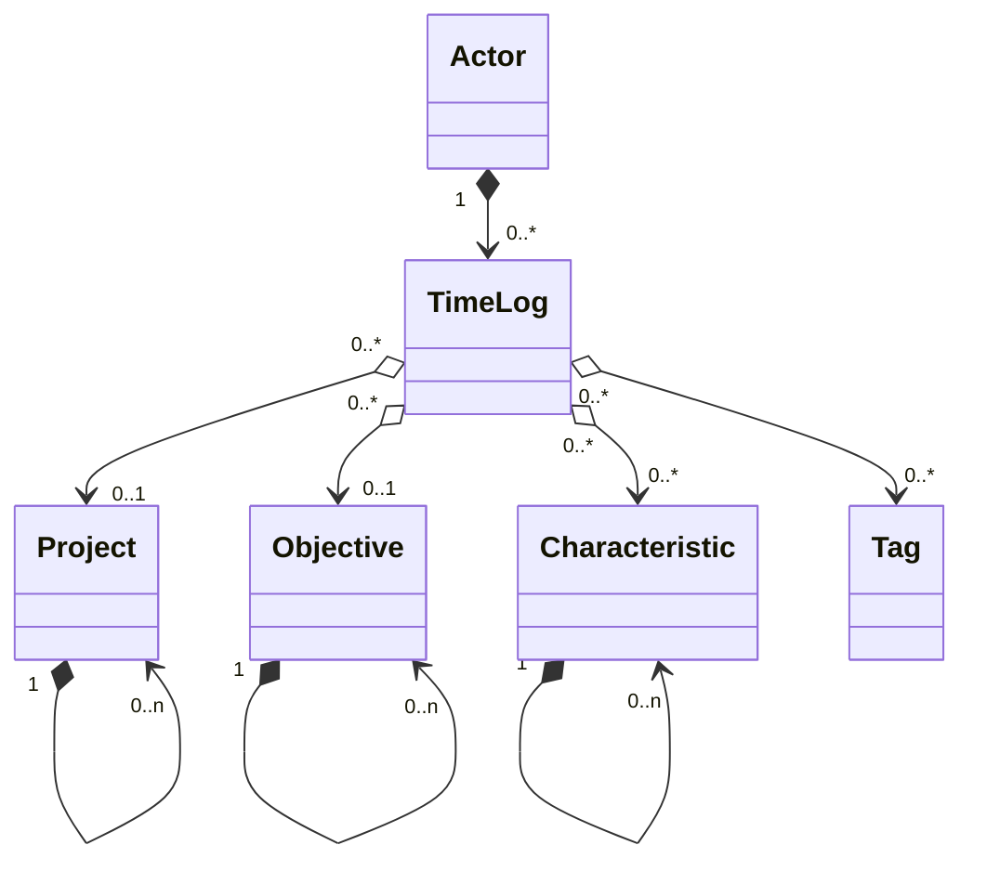
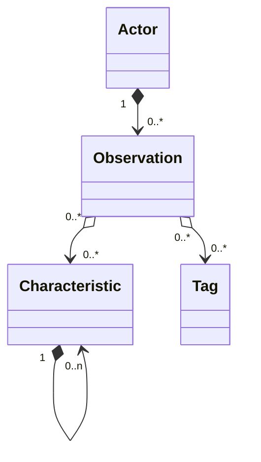

## Database Class Diagram

## Settings

```mermaid
classDiagram
	Grade "1" *--> "0..n" Actor
	Grade "1" *--> "0..n" Characteristic
	Characteristic "1" *--> "0..n" Characteristic
	CharacteristicGroup "1"  *--> "0..n" Characteristic
	
	
	
	
```

## Timelogs

```mermaid
classDiagram
    Project "1" *--> "0..n" Project
    Objective "1" *--> "0..n" Objective
    Characteristic "1" *--> "0..n" Characteristic

	Actor "1" *--> "0..*" TimeLog
	TimeLog "0..*" o--> "0..1" Project
	TimeLog "0..*" o--> "0..1" Objective	
	TimeLog "0..*" o--> "0..*" Characteristic	
	TimeLog "0..*" o--> "0..*" Tag	
	
```

## Observations

```mermaid
classDiagram
    Characteristic "1" *--> "0..n" Characteristic

	Actor "1" *--> "0..*" Observation
	Observation "0..*" o--> "0..*" Characteristic	
	Observation "0..*" o--> "0..*" Tag	
```

