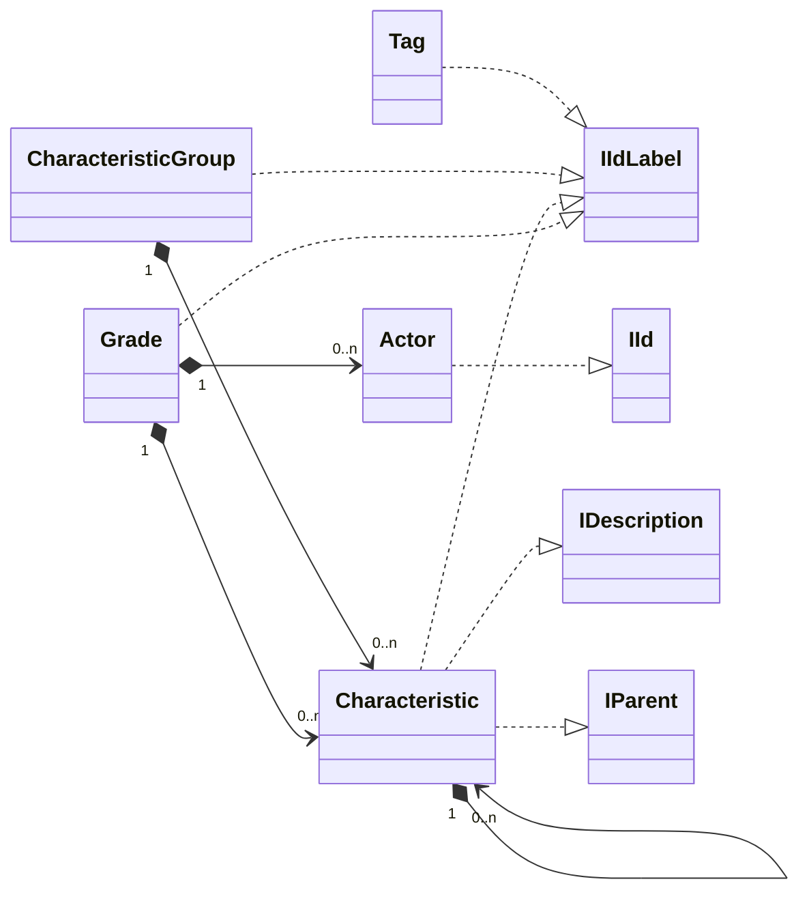
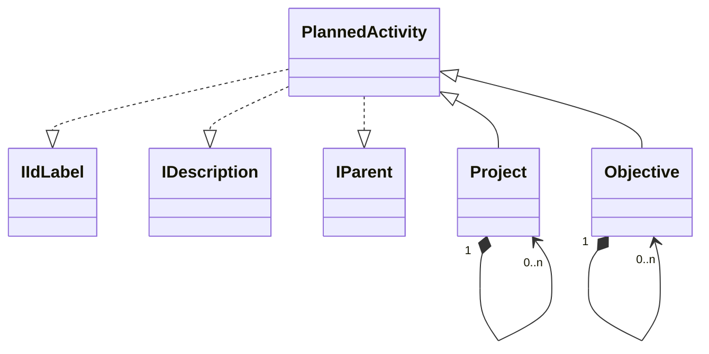
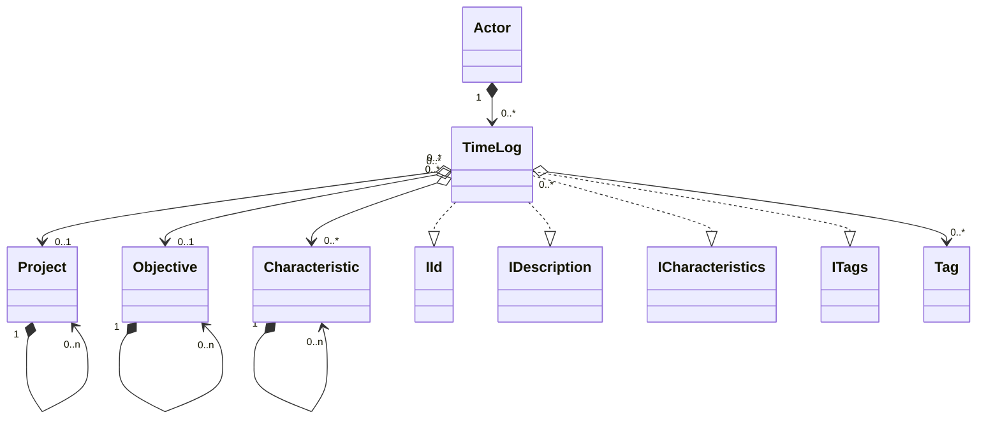
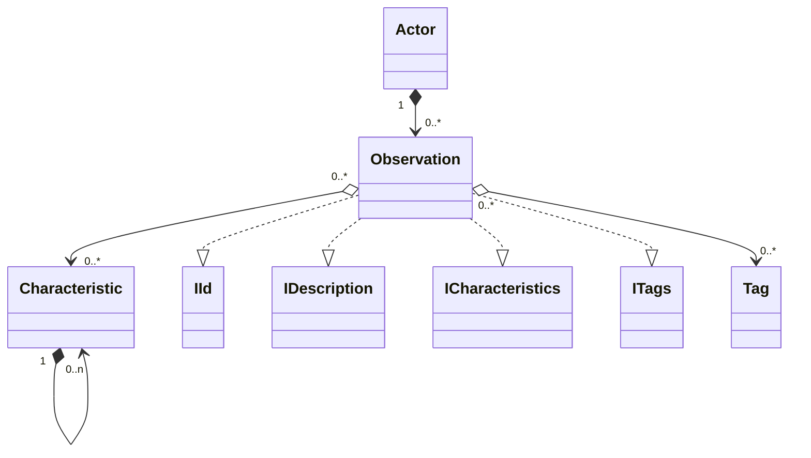

## Database Class Diagram

## Settings

```mermaid
classDiagram
  direction LR
	Grade ..|> IIdLabel
	Actor ..|> IId
	Grade "1" *--> "0..n" Actor
	Grade "1" *--> "0..n" Characteristic
	Characteristic ..|> IIdLabel
	Characteristic ..|> IDescription
	Characteristic ..|> IParent
	Characteristic "1" *--> "0..n" Characteristic
	CharacteristicGroup ..|> IIdLabel
	CharacteristicGroup "1"  *--> "0..n" Characteristic
	Tag ..|> IIdLabel
	
	
	
	
```

## Planned Activities

```mermaid
classDiagram
  direction TB
	Planned Activity ..|> IIdLabel
	Planned Activity ..|> IDescription
	Planned Activity ..|> IParent
	Planned Activity <|-- Project
  Planned Activity <|-- Objective
  Project "1" *--> "0..n" Project
  Objective "1" *--> "0..n" Objective
```

## Timelogs

```mermaid
classDiagram
  	direction TB
  	
    Characteristic "1" *--> "0..n" Characteristic
  	Project "1" *--> "0..n" Project
  	Objective "1" *--> "0..n" Objective
  	
    Actor "1" *--> "0..*" TimeLog
    TimeLog ..|> IId
    TimeLog ..|> IDescription
    TimeLog ..|> ICharacteristics
    TimeLog ..|> ITags
    TimeLog "0..*" o--> "0..1" Project
    TimeLog "0..*" o--> "0..1" Objective	
    TimeLog "0..*" o--> "0..*" Characteristic	
    TimeLog "0..*" o--> "0..*" Tag	
	
```

## Observations

```mermaid
classDiagram
  	direction TB

    Characteristic "1" *--> "0..n" Characteristic

    Observation ..|> IId
    Observation ..|> IDescription
    Observation ..|> ICharacteristics
    Observation ..|> ITags
    Actor "1" *--> "0..*" Observation
    Observation "0..*" o--> "0..*" Characteristic	
    Observation "0..*" o--> "0..*" Tag	
```

